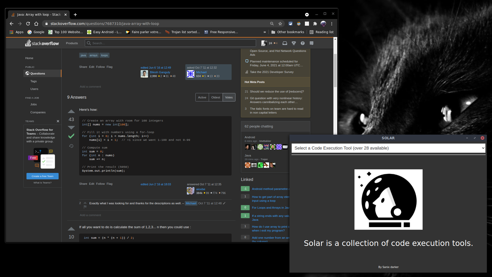

# S0l4r

A Browser Extension allowing you to test your code online in one click with more than 40 tools.

## Requirements

- Chrome browser (Any version supporting the extensions Feature).
- Developer tools activated (in case this extension is not allready on Chrome store).

### How it's works

S0l4r have a list of tools available in one pack.

### How to use it

> See the <a href="https://youtu.be/993jUXx3NuY" target="_blank">DEMO VIDEO</a>

* Enable the Developer Mode a top right in your "chrome://extensions" settings page.
* Integrate the Extension in your browser, the extension is not yet on a store so....
* Click on the Select to choose the tool.

### Rendering

### Author

- [Sanix darker](https://github.com/Sanix-Darker)